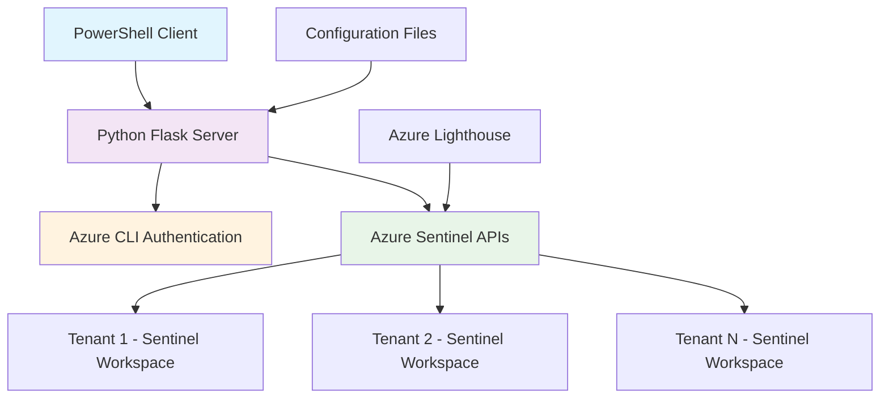
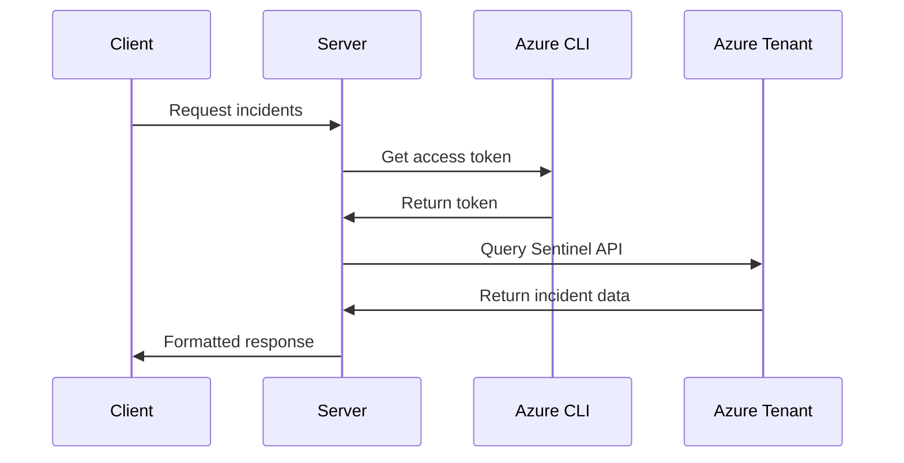

# Architecture Documentation

## System Architecture

The Azure Sentinel Triage Bot follows a client-server architecture designed for security operations centers (SOCs) operating in Azure environments with multiple tenant access.

### High-Level Architecture



### Component Details

#### 1. PowerShell Client
- **Purpose**: Interactive user interface for security analysts
- **Technology**: PowerShell 5.1+
- **Key Features**:
  - Interactive chat interface
  - Command-line operations
  - Tenant switching capabilities
  - Report generation
  - Authentication status monitoring

#### 2. Python Flask Server
- **Purpose**: API orchestration and Azure integration
- **Technology**: Python 3.8+ with Flask framework
- **Key Components**:
  - REST API endpoints
  - Azure authentication management
  - Configuration management
  - Sentinel API integration
  - Logging and monitoring

#### 3. Authentication Layer
- **Method**: Azure CLI-based authentication
- **Benefits**:
  - Leverages existing z-account privileges
  - No credential storage required
  - Automatic token refresh
  - Multi-tenant support

#### 4. Configuration Management
- **Tenant Configuration**: JSON-based tenant definitions
- **Application Settings**: Environment-specific configurations
- **Security**: Sensitive data excluded from version control

### Data Flow

1. **Client Request**: Analyst enters command or natural language query
2. **API Call**: Client sends HTTP request to Flask server
3. **Authentication**: Server validates Azure CLI authentication status
4. **Tenant Resolution**: Server identifies target tenant(s) for query
5. **Azure API Call**: Server makes authenticated requests to Sentinel APIs
6. **Data Processing**: Server processes and formats response data
7. **Response**: Client receives and displays formatted results

### Security Architecture

#### Authentication Flow


#### Security Boundaries
- **Network Isolation**: PAW network restrictions
- **Authentication**: Azure AD-based authentication
- **Authorization**: Azure RBAC for resource access
- **Audit**: All API calls logged for compliance

### Deployment Architecture

#### Development Environment
```
Developer Workstation
├── Client (PowerShell)
├── Server (Python - Local)
└── Configuration (Local Files)
```

#### Production Environment (PAW)
```
Privileged Access Workstation
├── Client (PowerShell)
├── Server (Python - Containerized)
├── Configuration (Secure Storage)
└── Logging (Centralized)
```

### Scalability Considerations

#### Horizontal Scaling
- Multiple server instances behind load balancer
- Stateless server design for easy scaling
- Cached authentication tokens

#### Performance Optimization
- Connection pooling for Azure APIs
- Configurable query limits
- Asynchronous processing for large datasets

### Monitoring and Observability

#### Application Monitoring
- Health check endpoints
- Performance metrics
- Error tracking and alerting

#### Security Monitoring
- Authentication events
- API access patterns
- Failed request tracking

### Integration Points

#### Azure Services
- **Azure Sentinel**: Primary data source
- **Azure Lighthouse**: Multi-tenant access
- **Azure Active Directory**: Authentication
- **Azure Monitor**: Logging (optional)

#### External Systems
- **SIEM Platforms**: Data export capabilities
- **Ticketing Systems**: Incident integration (future)
- **Notification Systems**: Alert routing (future)

### Future Architecture Enhancements

#### Planned Improvements
1. **Caching Layer**: Redis for improved performance
2. **Message Queue**: Asynchronous processing
3. **Database**: Persistent storage for analytics
4. **Web UI**: Browser-based interface option
5. **API Gateway**: Enhanced security and routing